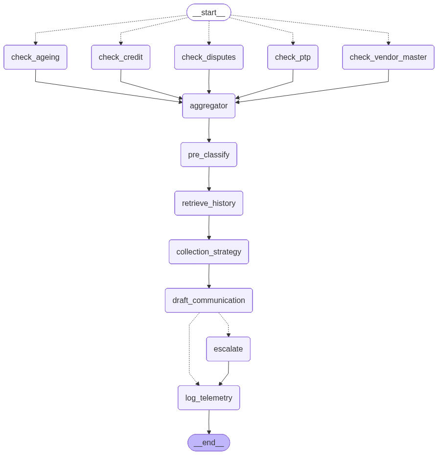

# 💰 Collections AI Agent

[](https://aneesh-collections-ai-agent.streamlit.app/)
[](https://youtu.be/T6nuN8oWnps)
[](https://www.python.org)
[](https://langchain-ai.github.io/langgraph/)

**An enterprise-grade agentic AI system for accounts receivable risk assessment and collections strategy automation.**

**🚀 Try it live:** [aneesh-collections-ai-agent.streamlit.app](https://aneesh-collections-ai-agent.streamlit.app/)

---

## 🎯 What This Does

The Collections AI Agent automates the workflow that a senior collections analyst performs manually for every overdue invoice — but does it consistently, auditably, and at scale.

For every invoice uploaded, the agent:

1. **Gathers signals** from 5 utility agents in parallel (aging, disputes, PTP history, credit balance, vendor master)
2. **Retrieves historical context** from a vector store of past decisions (RAG)
3. **Scores risk** using a defined rubric (0-15 points) producing auditable decisions
4. **Recommends a specific action** from 6 predefined strategies
5. **Drafts the actual communication** ready for human review
6. **Logs every decision** to a telemetry database for compliance and analysis

A human collector reviewing 100 invoices per day handles in 8 hours what this agent processes in 5 minutes — with full audit trail.

---

## 🔄 Architecture — 11-Node LangGraph Pipeline

```
START
  ↓
check_ageing          Reads aging_buckets.csv → flags 61-90 / 90+ day exposure
  ↓
check_disputes        Reads dispute_history.csv → counts open disputes
  ↓
check_ptp             Reads ptp_history.csv → counts broken promises
  ↓
check_credit          Reads credit_balance.csv → flags 80%+ utilisation
  ↓
check_vendor_master   Reads vendor_master.csv → vendor tier and payment score
  ↓
pre_classify          Rules-based: overdue flag, days overdue, amount tier
  ↓
retrieve_history      RAG: queries vector store for similar past cases
  ↓
collection_strategy   Claude API with rubric scoring → risk rating + action
  ↓
draft_communication   Claude API → drafts actual email per recommended action
  ↓ (conditional edge by route_by_risk)
  ├── HIGH → escalate → log_telemetry → END
  └── LOW/MEDIUM → log_telemetry → END
```



---

## 🏗️ Architecture Patterns

### Pattern 1 — Rule + LLM Hybrid
Deterministic rules for codifiable decisions (pre-classify). LLM only where genuine judgment is required (collection strategy, communication drafting). Reduces cost per invoice by ~60% versus pure LLM approaches while maintaining auditability.

### Pattern 2 — RAG (Retrieval Augmented Generation)
Past decisions stored as vectors. New invoices query for similar historical cases before strategy decision. Agent learns from institutional history rather than treating each invoice as new.

### Pattern 3 — Rubric-Based Decision Scoring
Collection Strategy Agent follows explicit 0-15 point rubric. Every signal is scored. Total determines risk rating. Decision is fully reconstructable and explainable — critical for enterprise compliance.

### Pattern 4 — Recommended Action Output
Strategy agent does not just rate risk — it recommends one of 6 specific actions:
- `SEND_COURTESY_REMINDER`
- `SEND_DUNNING_LEVEL_1`  
- `SEND_DUNNING_LEVEL_2`
- `ESCALATE_SENIOR_MANAGEMENT`
- `PLACE_CREDIT_HOLD`
- `INITIATE_LEGAL_REVIEW`

Communication Drafting Agent then produces the appropriate email based on this decision.

### Pattern 5 — Separation of Strategy from Drafting
Two distinct nodes. Strategy decides what action to take. Drafting produces the artifact. Each agent has one responsibility — testable, debuggable, swappable.

---

## 🛠️ Tech Stack

| Layer | Technology |
|-------|-----------|
| AI/LLM | Claude Sonnet 4.5 (Anthropic API) |
| Orchestration | LangGraph |
| Frontend | Streamlit |
| Database | SQLite (telemetry) |
| RAG Layer | Custom vector store (hash embeddings) |
| Data | Pandas |
| Language | Python 3.12 |

---

## 📊 Scoring Rubric

| Signal | Threshold | Points |
|--------|-----------|--------|
| Aging Risk Flag | True | +2 |
| Disputes | 2+ open | +3 |
| Disputes | 1 open | +2 |
| PTP Broken | 3+ promises | +3 |
| PTP Broken | 1-2 promises | +2 |
| Credit Utilisation | >90% | +3 |
| Credit Utilisation | 70-90% | +2 |
| Vendor Risk Flag | True | +2 |
| Days Overdue | >30 | +3 |
| Days Overdue | 1-30 | +1 |

**Thresholds:** 0-3 → LOW · 4-7 → MEDIUM · 8+ → HIGH

---

## 🎬 Demo

[Watch the demo video](https://youtu.be/T6nuN8oWnps) or try the live app:

```
https://aneesh-collections-ai-agent.streamlit.app/
```

Upload any invoice CSV with columns: `vendor, invoice_amount, days_since_invoice, payment_term_days`

---

## 🚀 Run Locally

### 1. Clone the repo
```bash
git clone https://github.com/aneeshg20/collections-ai-agent.git
cd collections-ai-agent
```

### 2. Install dependencies
```bash
pip install -r requirements.txt
```

### 3. Set up environment
```bash
cp .env.example .env
# Add your Anthropic API key to .env
```

### 4. Initialise the database
```bash
python agent/setup_database.py
```

### 5. Build the vector store
```bash
python agent/chromadb_setup.py
```

### 6. Run the app
```bash
streamlit run agent/app.py
```

---

## 📁 Project Structure

```
collections-ai-agent/
├── agent/
│   ├── app.py                  # Streamlit dashboard
│   ├── setup_database.py       # SQLite initialisation
│   ├── chromadb_setup.py       # Vector store builder
│   ├── create_synthetic_data.py # Generates UA datasets
│   ├── telemetry_logger.py     # Original Claude pipeline
│   ├── aging_buckets.csv       # AR aging by vendor
│   ├── dispute_history.csv     # Active and resolved disputes
│   ├── ptp_history.csv         # Promise-to-pay records
│   ├── credit_balance.csv      # Credit limits and utilisation
│   ├── vendor_master.csv       # Vendor tiers and scores
│   ├── invoices.csv            # Sample invoices
│   └── graph_visualisation.png # LangGraph architecture diagram
├── dev/                        # LangGraph development iterations
│   ├── langgraph_Day1.py       # Single node graph
│   ├── langgraph_Day2.py       # Two nodes + pre_classify
│   ├── ...
│   └── langgraph_Day10.py      # Full 11-node pipeline
├── vector_store.json           # RAG vector store
├── requirements.txt
└── README.md
```

---

## 💼 Business Case

### Effort Reduction
- Manual collector handles 50-100 invoices per day with 15-20 min decision time
- Agent processes 10,000 invoices in ~10 minutes  
- Effort reduction on initial assessment: ~90%
- Reallocates analyst time to complex dispute resolution

### Working Capital Impact
- Faster, more consistent risk assessment shortens collection cycles
- Even a small DSO reduction releases proportional working capital from AR
- Working capital savings = (Annual Revenue / 365) × Days of DSO Reduction
- At typical enterprise cost of capital, every day of DSO improvement also reduces finance costs
- Impact scales linearly with portfolio size — larger AR portfolios see larger absolute savings

### Consistency and Compliance
- Every decision follows the same rubric — eliminates analyst-to-analyst variability
- Full audit trail of every assessment
- Recommended actions tied to defined policy thresholds
- Communications calibrated to vendor tier and risk level

---

## 🗺️ Roadmap

### v1.0 — Batch Processor ✅ Complete
- 11-node LangGraph pipeline
- 5 Utility Agents enriching state
- Rubric-based Collections Strategy Agent
- RAG retrieval of past decisions
- Communication Drafting Agent
- Streamlit dashboard with drill-down analytics
- Public deployment on Streamlit Cloud

### v1.5 — Workflow Layer 🔄 In Progress
- Orchestrator Agent for parallel UA execution (LangGraph Send API)
- Human-in-the-loop approval before communication send
- Docker containerisation
- Observer Agent for telemetry pattern analysis
- Semantic embeddings upgrade (sentence-transformers or Anthropic embeddings)

### v2.0 — Stateful Lifecycle Engine 📋 Roadmap
- Unique invoice_id tracking across processing cycles
- Invoice status state machine (NEW → ASSESSED → SOA_SENT → DISPUTED/PTP/DUNNING → RESOLVED)
- Event log table with full touchpoint history per invoice
- Mailbox monitoring for inbound customer events (Gmail MCP)
- Conditional dunning suppression when active PTP exists
- Dispute Handler Agent for in-flight customer responses
- Stateful agent re-entry from last known state

---

## 🎓 What This Demonstrates

For prospective employers and consulting clients, this project demonstrates:

- **Domain expertise** — Real source-to-cash collections workflow with accurate risk signals
- **Architectural maturity** — Hybrid rules+LLM, RAG retrieval, separation of strategy from drafting
- **Production thinking** — Telemetry logging, conditional edges, action-based routing
- **Self-aware engineering** — Clear v1.0/v1.5/v2.0 phasing documenting what is built vs roadmap
- **End-to-end delivery** — From local development through Cloud deployment with public URL

---

## 👤 Author

**Aneesh Ghosh**
- IIT Kanpur MBA — Operations & Analytics
- 5+ years in source-to-cash transformation (AP, PTP, Collections, Supply Chain)
- Currently deploying agentic AI for enterprise managed services clients

🔗 LinkedIn: [Aneesh Ghosh](https://www.linkedin.com/in/aneeshghosh96/)  
📂 GitHub: [@aneeshg20](https://github.com/aneeshg20)

---

## 📜 License

MIT License — feel free to learn from, adapt, or build upon this work.

---

*Built between April 25 - June 2026. From zero Python to a production-deployed AI agent in 6 weeks.*