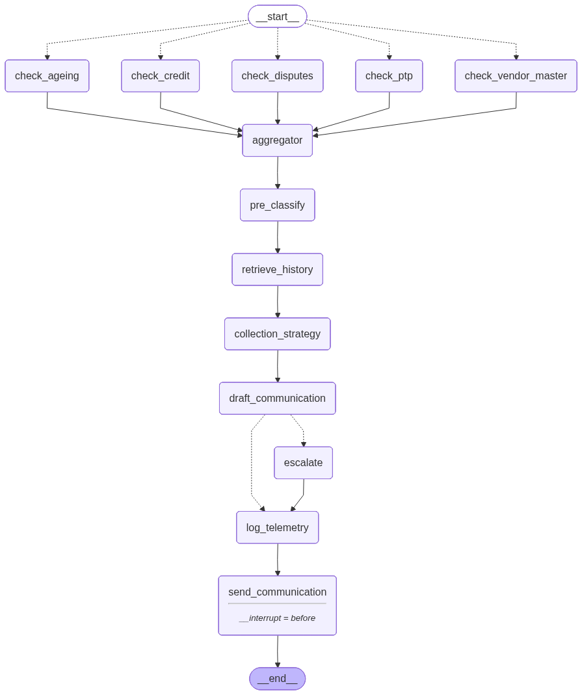

# 💰 Collections AI Agent

[](https://aneesh-collections-ai-agent.streamlit.app/)
[](https://www.python.org)
[](https://langchain-ai.github.io/langgraph/)
[](https://www.docker.com/)

**An enterprise-grade agentic AI system for accounts receivable risk assessment and collections strategy automation — with human-in-the-loop approval, semantic retrieval, and arbitrary-schema ingestion.**

**🚀 Try it live:** [aneesh-collections-ai-agent.streamlit.app](https://aneesh-collections-ai-agent.streamlit.app/)

---

## 🎯 What This Does

The Collections AI Agent automates the workflow a senior collections analyst performs manually for every overdue invoice — consistently, auditably, and at scale, while keeping a human in control of every consequential action.

For every invoice uploaded, the agent:

1. **Ingests any CSV structure** via a Claude-powered Schema Mapper that maps arbitrary columns to the required schema — and refuses to proceed on insufficient data rather than hallucinating
2. **Gathers signals** from 5 utility agents dispatched in parallel (aging, disputes, PTP history, credit balance, vendor master)
3. **Retrieves historical context** from a semantic vector store of past decisions (RAG)
4. **Scores risk** using a defined rubric (0-15 points) producing auditable decisions
5. **Recommends a specific action** from 6 predefined collections strategies
6. **Drafts the actual communication** calibrated to vendor tier and risk level
7. **Pauses at a human approval gate** — nothing is sent until a human reviews and approves, with full state persisted to disk
8. **Logs every decision** to a telemetry database for compliance and cross-run analysis

---

## 🔄 Architecture — 12-Node LangGraph Pipeline with HITL

```
START
  ↓
orchestrator_dispatch        Send API → 5 utility agents in parallel
  ├── check_ageing           Reads aging_buckets.csv → flags 61-90 / 90+ day exposure
  ├── check_disputes         Reads dispute_history.csv → counts open disputes
  ├── check_ptp              Reads ptp_history.csv → counts broken promises
  ├── check_credit           Reads credit_balance.csv → flags 80%+ utilisation
  └── check_vendor_master    Reads vendor_master.csv → vendor tier and payment score
  ↓
aggregator                   Parallel merge point — waits for all 5 UAs
  ↓
pre_classify                 Rules-based: overdue flag, days overdue, amount tier
  ↓
retrieve_history             RAG: semantic search over past decisions (sentence-transformers)
  ↓
collection_strategy          Claude API with rubric scoring → risk rating + action
  ↓
draft_communication          Claude API → drafts actual email per recommended action
  ↓ (conditional edge by route_by_risk)
  ├── HIGH → escalate → log_telemetry
  └── LOW/MEDIUM → log_telemetry
  ↓
[ interrupt_before ]         ⏸️ HUMAN APPROVAL GATE — state persisted via checkpointer
  ↓
send_communication           Runs only after human approval
  ↓
END
```



---

## 🏗️ Architecture Patterns

### Pattern 1 — Orchestrator with Parallel Dispatch
The 5 utility agents run concurrently via LangGraph's `Send` API, dispatched by an orchestrator node and rejoined at an aggregator. Demonstrates the map-reduce / fan-out-fan-in pattern in an agentic context.

### Pattern 2 — Rule + LLM Hybrid
Deterministic rules for codifiable decisions (pre-classify). LLM only where genuine judgment is required (collection strategy, communication drafting). Keeps cost down and decisions auditable.

### Pattern 3 — Semantic RAG (Retrieval Augmented Generation)
Past decisions stored as 384-dimension sentence-transformer embeddings (`all-MiniLM-L6-v2`). New invoices retrieve genuinely similar historical cases by meaning, not keyword overlap. Replaced an earlier hash-embedding prototype — retrieval quality improved measurably (relevant vendor cases now surface at ~0.65 similarity versus near-random before).

### Pattern 4 — Human-in-the-Loop with State Persistence
The agent pauses before any consequential action using `interrupt_before` and a SQLite checkpointer. State is persisted to disk during the pause — the workflow can resume after a process restart, and every approval is auditable. Implemented at three levels: standalone, single-invoice UI, and batch (per-invoice approval across many simultaneously-paused graphs).

### Pattern 5 — Schema Mapping Agent
A Claude-powered ingestion layer maps arbitrary CSV column names to the required schema by reasoning semantically over column names and sample rows. Returns `null` for unmappable fields and blocks the pipeline on insufficient data — refusing to guess rather than processing bad input.

### Pattern 6 — Observability Layer
A separate Observer module performs cross-run analysis over the telemetry table — risk distribution, vendor risk patterns, repeat-offender detection, action distribution. Deliberately not a graph node: cross-run patterns operate at a different scope than single-run execution.

### Pattern 7 — Rubric-Based Decision Scoring
The Collection Strategy Agent follows an explicit 0-15 point rubric. Every signal is scored; the total determines the rating. Decisions are fully reconstructable — critical for enterprise compliance.

---

## 🛠️ Tech Stack

| Layer | Technology |
|-------|-----------|
| AI/LLM | Claude Sonnet 4.5 (Anthropic API) |
| Orchestration | LangGraph (Send API, conditional edges, checkpointer) |
| HITL / State | `interrupt_before` + SqliteSaver checkpointer |
| RAG Layer | sentence-transformers (`all-MiniLM-L6-v2`, 384-dim) |
| Frontend | Streamlit |
| Database | SQLite (telemetry + checkpoints) |
| Containerisation | Docker |
| Data | Pandas |
| Language | Python 3.12 |

---

## 📊 Scoring Rubric

| Signal | Threshold | Points |
|--------|-----------|--------|
| Aging Risk Flag | True | +2 |
| Disputes | 2+ open | +3 |
| Disputes | 1 open | +2 |
| PTP Broken | 3+ promises | +3 |
| PTP Broken | 1-2 promises | +2 |
| Credit Utilisation | >90% | +3 |
| Credit Utilisation | 70-90% | +2 |
| Vendor Risk Flag | True | +2 |
| Days Overdue | >30 | +3 |
| Days Overdue | 1-30 | +1 |

**Thresholds:** 0-3 → LOW · 4-7 → MEDIUM · 8+ → HIGH

---

## 🚀 Run Locally

### 1. Clone the repo
```bash
git clone https://github.com/aneeshg20/collections-ai-agent.git
cd collections-ai-agent
```

### 2. Install dependencies
```bash
pip install -r requirements.txt
```

### 3. Set up environment
```bash
cp .env.example .env
# Add your Anthropic API key to .env
```

### 4. Initialise the database and vector store
```bash
python agent/setup_database.py
python agent/chromadb_setup.py
```

### 5. Run the app
```bash
streamlit run agent/app_v2.py
```

---

## 🐳 Run with Docker

```bash
# Build the image
docker build -t collections-ai-agent .

# Run the container (passes your .env for the API key)
docker run -p 8501:8501 --env-file .env collections-ai-agent
```

Then open `http://localhost:8501`. The entire pipeline — semantic RAG, HITL, Schema Mapper — runs self-contained in the container with no host Python setup required.

---

## 💼 Business Case

### Effort Reduction
- Manual collectors handle 50-100 invoices per day at 15-20 min decision time each
- The agent processes a portfolio in minutes with a full audit trail
- ~90% effort reduction on initial assessment, reallocating analyst time to complex dispute resolution

### Working Capital Impact
- Faster, more consistent risk assessment shortens collection cycles
- Optimized working capital management
- Every day of DSO improvement also reduces finance costs at the enterprise cost of capital
- Impact scales linearly with portfolio size

### Consistency and Compliance
- Every decision follows the same rubric — eliminates analyst-to-analyst variability
- Full audit trail of every assessment and every human approval
- Recommended actions tied to defined policy thresholds
- Human-in-the-loop ensures no consequential communication is sent autonomously

---

## 🗺️ Roadmap

### v1.0 — Batch Processor ✅ Complete
- LangGraph pipeline, 5 parallel utility agents, rubric-based strategy
- RAG retrieval, communication drafting, Streamlit Cloud deployment

### v1.5 — Workflow Layer ✅ Complete
- Orchestrator with parallel UA dispatch (Send API)
- Human-in-the-loop approval with checkpointer state persistence (standalone + single + batch)
- Observer Agent for cross-run telemetry analysis
- Schema Mapper Agent for arbitrary-CSV ingestion with insufficiency handling
- Semantic embeddings upgrade (sentence-transformers)
- Docker containerisation

### v2.0 — Stateful Lifecycle Engine 📋 Roadmap
- Unique invoice_id tracking across processing cycles
- Invoice status state machine (NEW → ASSESSED → SOA_SENT → DISPUTED/PTP/DUNNING → RESOLVED)
- Event log table with full touchpoint history per invoice
- Mailbox monitoring for inbound customer events (Gmail MCP)
- Conditional dunning suppression when an active PTP exists
- Dispute Handler Agent for in-flight customer responses
- Observer feedback loop — acting on detected patterns, not just reporting them
- Stateful agent re-entry from last known state

---

## 🎓 What This Demonstrates

- **Domain expertise** — Real source-to-cash collections workflow with accurate risk signals
- **Architectural maturity** — Orchestration, semantic RAG, HITL with state persistence, separation of concerns
- **Production thinking** — Telemetry, observability, containerisation, graceful failure on bad input
- **AI governance** — Human-in-the-loop for consequential actions, full auditability
- **End-to-end delivery** — From local development through Cloud deployment and containerisation

---

## 👤 Author

**Aneesh Ghosh**
- IIT Kanpur MBA — Operations & Analytics
- Source-to-cash transformation across AP, PTP, Collections, and Supply Chain
- Building and deploying agentic AI for enterprise managed services clients

🔗 LinkedIn: [Aneesh Ghosh](https://www.linkedin.com/in/aneeshghosh96/)
📂 GitHub: [@aneeshg20](https://github.com/aneeshg20)

---

## 📜 License

MIT License — feel free to learn from, adapt, or build upon this work.
